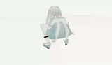
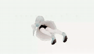
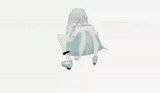
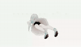
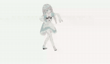
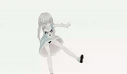
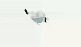

# VIREA

VIREA is a VRM-native motion data infrastructure project. Its core idea is simple:

```text
heterogeneous human motion datasets
  -> explicit source adapters
  -> canonical / VRM humanoid motion
  -> quality reports
  -> real avatar preview
  -> future text-to-VRM and dialogue-to-motion models
```

The current repository focuses on the data and playback substrate, not on a final
generation model. The important result is that AMASS, BABEL, BEAT, GRAB,
HumanML3D, Motion-X, and SuSuInterActs can be inspected through one pipeline and
previewed on a real VRM avatar.

## Result Board

The following 7 x 7 board was rendered from `demo` processed clips with the real
VRM model supplied through `VIREA_SHOWCASE_VRM`. The VRM file itself is not
committed. GitHub-renderable animated GIF previews are committed under
`doc/showcase/gifs/`, and each preview links to the original WebM under
`doc/showcase/videos/`.

<details open>
<summary>49 real VRM motion previews</summary>

### amass
| 1 | 2 | 3 | 4 | 5 | 6 | 7 |
| --- | --- | --- | --- | --- | --- | --- |
| [](doc/showcase/videos/01_amass_accad_female1running_c3d_c7_run_backwards_stageii.webm)<br><sub>1. `C7 run backwards`</sub> | [](doc/showcase/videos/02_amass_accad_female1running_c3d_c26_run_to_crouch_stageii.webm)<br><sub>2. `C26 run to crouch`</sub> | [](doc/showcase/videos/03_amass_accad_female1running_c3d_c8_run_backwards_to_stand_stageii.webm)<br><sub>3. `C8 back to stand`</sub> | [](doc/showcase/videos/04_amass_accad_female1running_c3d_c4_run_to_walk1_stageii.webm)<br><sub>4. `C4 run to walk`</sub> | [](doc/showcase/videos/05_amass_accad_female1walking_c3d_b25_crouch_to_walk1_stageii.webm)<br><sub>5. `B25 crouch to walk`</sub> | [](doc/showcase/videos/06_amass_accad_female1general_c3d_a10_lie_to_crouch_stageii.webm)<br><sub>6. `A10 lie to crouch`</sub> | [](doc/showcase/videos/07_amass_accad_female1walking_c3d_b2_walk_to_stand_t2_stageii.webm)<br><sub>7. `B2 walk to stand`</sub> |

### babel
| 1 | 2 | 3 | 4 | 5 | 6 | 7 |
| --- | --- | --- | --- | --- | --- | --- |
| [](doc/showcase/videos/01_babel_accad_female1running_c3d_c7_run_backwards_stageii.webm)<br><sub>1. `C7 run backwards`</sub> | [](doc/showcase/videos/02_babel_accad_female1running_c3d_c26_run_to_crouch_stageii.webm)<br><sub>2. `C26 run to crouch`</sub> | [](doc/showcase/videos/03_babel_accad_female1running_c3d_c8_run_backwards_to_stand_stageii.webm)<br><sub>3. `C8 back to stand`</sub> | [](doc/showcase/videos/04_babel_accad_female1running_c3d_c4_run_to_walk1_stageii.webm)<br><sub>4. `C4 run to walk`</sub> | [](doc/showcase/videos/05_babel_accad_female1walking_c3d_b25_crouch_to_walk1_stageii.webm)<br><sub>5. `B25 crouch to walk`</sub> | [](doc/showcase/videos/06_babel_accad_female1general_c3d_a10_lie_to_crouch_stageii.webm)<br><sub>6. `A10 lie to crouch`</sub> | [](doc/showcase/videos/07_babel_accad_female1walking_c3d_b2_walk_to_stand_t2_stageii.webm)<br><sub>7. `B2 walk to stand`</sub> |

### beat
| 1 | 2 | 3 | 4 | 5 | 6 | 7 |
| --- | --- | --- | --- | --- | --- | --- |
| [](doc/showcase/videos/01_beat_pose_1_1_wayne_0_28_28.webm)<br><sub>1. `wayne 28`</sub> | [](doc/showcase/videos/02_beat_pose_1_1_wayne_0_35_35.webm)<br><sub>2. `wayne 35`</sub> | [](doc/showcase/videos/03_beat_pose_1_1_wayne_0_1_1.webm)<br><sub>3. `wayne 1`</sub> | [](doc/showcase/videos/04_beat_pose_1_1_wayne_0_65_65.webm)<br><sub>4. `wayne 65`</sub> | [](doc/showcase/videos/05_beat_pose_1_1_wayne_0_114_114.webm)<br><sub>5. `wayne 114`</sub> | [](doc/showcase/videos/06_beat_pose_1_1_wayne_0_68_68.webm)<br><sub>6. `wayne 68`</sub> | [](doc/showcase/videos/07_beat_pose_1_1_wayne_0_7_7.webm)<br><sub>7. `wayne 7`</sub> |

### grab
| 1 | 2 | 3 | 4 | 5 | 6 | 7 |
| --- | --- | --- | --- | --- | --- | --- |
| [](doc/showcase/videos/01_grab_s1_bowl_drink_1.webm)<br><sub>1. `bowl drink`</sub> | [](doc/showcase/videos/02_grab_s1_banana_offhand_1.webm)<br><sub>2. `banana offhand`</sub> | [](doc/showcase/videos/03_grab_s1_binoculars_see_1.webm)<br><sub>3. `binoculars`</sub> | [](doc/showcase/videos/04_grab_s1_duck_offhand_1.webm)<br><sub>4. `duck offhand`</sub> | [](doc/showcase/videos/05_grab_s1_eyeglasses_clean_1.webm)<br><sub>5. `clean glasses`</sub> | [](doc/showcase/videos/06_grab_s1_cylindermedium_offhand_1.webm)<br><sub>6. `cylinder`</sub> | [](doc/showcase/videos/07_grab_s1_eyeglasses_offhand_1.webm)<br><sub>7. `glasses offhand`</sub> |

### humanml3d
| 1 | 2 | 3 | 4 | 5 | 6 | 7 |
| --- | --- | --- | --- | --- | --- | --- |
| [](doc/showcase/videos/01_humanml3d_test_test_00000_of_00002_2.webm)<br><sub>1. `row 2`</sub> | [](doc/showcase/videos/02_humanml3d_test_test_00000_of_00002_45.webm)<br><sub>2. `row 45`</sub> | [](doc/showcase/videos/03_humanml3d_test_test_00000_of_00002_3.webm)<br><sub>3. `row 3`</sub> | [](doc/showcase/videos/04_humanml3d_test_test_00000_of_00002_99.webm)<br><sub>4. `row 99`</sub> | [](doc/showcase/videos/05_humanml3d_test_test_00000_of_00002_24.webm)<br><sub>5. `row 24`</sub> | [](doc/showcase/videos/06_humanml3d_test_test_00000_of_00002_11.webm)<br><sub>6. `row 11`</sub> | [](doc/showcase/videos/07_humanml3d_test_test_00000_of_00002_96.webm)<br><sub>7. `row 96`</sub> |

### motionx
| 1 | 2 | 3 | 4 | 5 | 6 | 7 |
| --- | --- | --- | --- | --- | --- | --- |
| [](doc/showcase/videos/01_motionx_motion_data_smplx_322_aist_subset_0000_dance_break_3_step_clip_3.webm)<br><sub>1. `break 3 step`</sub> | [](doc/showcase/videos/02_motionx_motion_data_smplx_322_aist_subset_0000_dance_break_back_cc.webm)<br><sub>2. `break back cc`</sub> | [](doc/showcase/videos/03_motionx_motion_data_smplx_322_aist_subset_0000_dance_break_6_step_clip_8.webm)<br><sub>3. `break 6 step`</sub> | [](doc/showcase/videos/04_motionx_motion_data_smplx_322_aist_subset_0000_dance_break_3_step_clip_4.webm)<br><sub>4. `break clip 4`</sub> | [](doc/showcase/videos/05_motionx_motion_data_smplx_322_aist_subset_0000_dance_break_battle_rock_clip_14.webm)<br><sub>5. `battle rock 14`</sub> | [](doc/showcase/videos/06_motionx_motion_data_smplx_322_aist_subset_0000_dance_break_battle_rock_clip_15.webm)<br><sub>6. `battle rock 15`</sub> | [](doc/showcase/videos/07_motionx_motion_data_smplx_322_aist_subset_0000_dance_break_battle_rock_clip_13.webm)<br><sub>7. `battle rock 13`</sub> |

### susuinteracts
| 1 | 2 | 3 | 4 | 5 | 6 | 7 |
| --- | --- | --- | --- | --- | --- | --- |
| [](doc/showcase/videos/01_susuinteracts_fbx_to_json_data_susu_retarget_maya_20250806_human_susu_250804_150_6_02.webm)<br><sub>1. `susu 150-6`</sub> | [](doc/showcase/videos/02_susuinteracts_fbx_to_json_data_susu_retarget_maya_20250930_human_0916_138_4_5_01.webm)<br><sub>2. `0916 138`</sub> | [](doc/showcase/videos/03_susuinteracts_fbx_to_json_data_susu_retarget_maya_20251111_human_1021_292_2_2_02_xg.webm)<br><sub>3. `1021 292`</sub> | [](doc/showcase/videos/04_susuinteracts_fbx_to_json_data_susu_retarget_maya_20251016_human_0916_273_3_5_01.webm)<br><sub>4. `0916 273`</sub> | [](doc/showcase/videos/05_susuinteracts_fbx_to_json_data_susu_chonglu_20260119_human_351_96_01_a.webm)<br><sub>5. `chonglu 351`</sub> | [](doc/showcase/videos/06_susuinteracts_fbx_to_json_data_susu_retarget_maya_20251104_human_0916_153_1_1_01_xc.webm)<br><sub>6. `0916 153`</sub> | [](doc/showcase/videos/07_susuinteracts_fbx_to_json_data_susu_retarget_maya_20250923_human_0916_34_2_9_01.webm)<br><sub>7. `0916 34`</sub> |

</details>

The selection metadata is in
[`doc/showcase/showcase-samples.json`](doc/showcase/showcase-samples.json), and
the renderer is [`scripts/render_showcase.mjs`](scripts/render_showcase.mjs).

## Quick Start

### 1. Clone and install

Windows PowerShell:

```powershell
git clone git@github.com:Joker-of-Gotham/virea.git
cd virea
python -m venv .venv
.\.venv\Scripts\Activate.ps1
pip install -e ".[dev]"
npm install
```

macOS / Linux:

```bash
git clone git@github.com:Joker-of-Gotham/virea.git
cd virea
python3 -m venv .venv
source .venv/bin/activate
pip install -e ".[dev]"
npm install
```

### 2. Download demo data

Demo data (raw + processed) is hosted on HuggingFace:
https://huggingface.co/datasets/ChikaKomari/virea-demo

```bash
# Download all demo data (raw + processed, ~4 GB)
python scripts/download_demo.py

# Or download only raw (re-process locally)
python scripts/download_demo.py --raw-only
```

The script places files into `demo/raw/` and `demo/processed/` automatically.

### 3. Process and preview

```bash
# Process demo data (skip if you downloaded processed/)
python -m virea process --data-source demo --workers 8 --force

# Launch the viewer
python -m virea serve --data-source demo
```

Open the server URL printed by the CLI, load a `.vrm`, choose a sample, then
compare source, processed, and real avatar playback.

### 4. Full dataset (optional)

To use the full external dataset, set the environment variable:

```powershell
$env:VIREA_RAW_ROOT = "<path-to-full-raw-datasets>"
```

```bash
export VIREA_RAW_ROOT="<path-to-full-raw-datasets>"
```

## Pipeline

```text
DatasetAdapter
  -> RawClip
  -> MotionCodec.extract_source()      # before preview
  -> MotionCodec.to_canonical()        # canonical / VRM motion
  -> ProcessingPipeline                # persisted artifacts
  -> PreviewReader / FastAPI           # read-only serving
  -> viewer-web + real VRM avatar
```

Key conventions:

- world coordinates are normalized to glTF / VRM `+Y` up, `+Z` forward
- FPS is preserved per clip during playback
- source preview and processed preview are intentionally separate
- retargeting records provenance, coordinate basis, scale, and quality metrics
- large third-party raw datasets stay outside Git; lightweight showcase videos
  and metadata can be committed

## Configuration

Machine-specific paths must be supplied through environment variables, never
committed into source or docs:

- `VIREA_RAW_ROOT`: full raw dataset root
- `VIREA_PROCESSED_ROOT`: optional processed artifact root
- `VIREA_VRM_MODEL_ROOT`: optional VRM rest-template inspection root
- `VIREA_VRM_MOTION_PYTHONPATH`: optional external `vrm_motion` Python package path
- `VIREA_TMR_SRC`: optional HumanML3D/TMR decoder source path
- `VIREA_THREE_ROOT` and `VIREA_THREE_VRM_ROOT`: optional viewer runtime packages;
  normally `npm install` is enough
- `VIREA_SHOWCASE_SERVER` and `VIREA_SHOWCASE_VRM`: showcase renderer inputs
- `VIREA_SERVE_HOST` and `VIREA_SERVE_PORT`: optional server bind settings

## Documentation

- [Documentation index](doc/README.zh-CN.md)
- [Theory and scope](doc/theory.zh-CN.md)
- [Engineering design](doc/engineering-design.zh-CN.md)
- [Pipeline guide](doc/pipeline.zh-CN.md)
- [Showcase generation](doc/showcase/README.md)
- [Reference baseline](doc/references.zh-CN.md)
- [SuSu audit notes](doc/susu-pipeline-audit.zh-CN.md)

## Checks

```bash
python -m compileall -q src
python -m pytest -q
npm run check
python scripts/smoke_pipeline.py --data-source demo --max-frames 8
python scripts/smoke_pipeline.py --data-source full --max-frames 8
```

## License Note

Dataset licenses are source-specific. This repository does not grant permission
to redistribute third-party raw datasets. Use the original terms for AMASS,
BABEL, BEAT, GRAB, HumanML3D, Motion-X, SuSuInterActs, and any VRM model used
for rendering.
