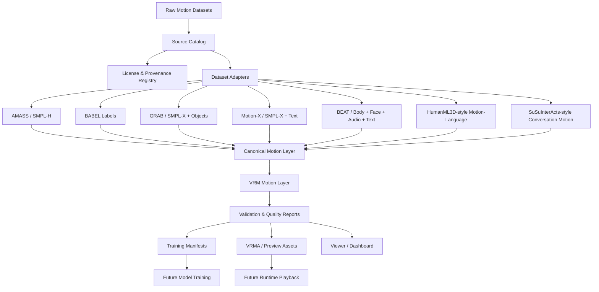

# VIREA

> **VIREA: VRM-native Interactive Response & Embodied Avatar**

VIREA is a VRM-native research infrastructure project for interactive embodied
avatar motion. It focuses on building a clean, extensible, license-aware, and
VRM-centered motion data foundation for future **text-to-VRM-motion** and
**conversation-driven avatar behavior generation**.

Modern image and video generation systems can create visually realistic worlds,
but they do not necessarily produce executable bodies. VIREA treats the VRM
humanoid skeleton as an executable embodied interface between high-level
semantic intent and low-level continuous motion.

For Chinese documentation, see [doc/README.zh-CN.md](doc/README.zh-CN.md).

## Status

**Current stage:** early research scaffold and data infrastructure design.

## Implemented Bootstrap Components

The repository now includes an initial modular data-preview scaffold:

- Dataset registry, license registry, citation registry, and skeleton registry.
- Dataset adapters for AMASS, BABEL, BEAT, GRAB, HumanML3D, Motion-X, and SuSuInterActs.
- Shape-specific motion codecs instead of dataset-name-driven conversion branches.
- Two preview pipelines: source-native `raw_preview` and canonical / VRM-centered `processed_preview`.
- Two selectable data sources: `full` for the complete local raw directory and `demo` for a same-layout fixture under `demo/raw`.
- A FastAPI runtime plus a unified web frontend under `apps/viewer-web/`.
- Local `three.js` / `three-vrm` `.vrm` import with humanoid pose driving from the processed VRM motion payload.
- Synchronized timeline controls for before / after / VRM avatar playback, plus light and dark viewer themes.
- Interactive CLI, demo builder, full/demo conversion command, smoke script, and mathematical verification command.
- JSON schemas for processed `MotionSample`, dataset manifest, and quality report records.
- Full-clip previews by default; frame limiting only happens when `max_frames` is explicitly supplied.

Detailed Chinese implementation notes are in
[doc/data-pipeline.zh-CN.md](doc/data-pipeline.zh-CN.md). The SuSuInterActs
root-scale and skeleton-alignment audit is documented in
[doc/susu-pipeline-audit.zh-CN.md](doc/susu-pipeline-audit.zh-CN.md).

Minimal local run:

```powershell
$env:PYTHONPATH = "D:\AI-Program-Project\virea\src"
python -m virea.cli build-demo --overwrite
python -m virea.cli convert --data-source demo --continue-on-error --report demo\conversion-report.json
python -m virea.cli serve --data-source demo --host 127.0.0.1 --port 8014
```

This repository is not yet a final model release. The first milestone is to
construct a reliable **VRM motion-centered data platform** before committing to
any specific model family such as diffusion, flow matching, VQ-VAE,
Transformer, latent diffusion, or MLLM-based generation.

At the bootstrap stage, the repository intentionally keeps the checked-in file
surface small. The target architecture documented below describes the intended
project direction; it is not a claim that every module has already been
implemented.

## Project Positioning

VIREA aims to support the following long-term scenario:

```text
User dialogue / context / emotion / audio
        |
        v
semantic motion intent
        |
        v
continuous VRM humanoid motion
        |
        v
VRM avatar playback in a live interactive conversation
```

The immediate objective is more specific:

```text
heterogeneous human motion datasets
        |
        v
canonical motion representation
        |
        v
VRM-centered motion assets
        |
        v
training-ready motion data + previewable VRM animation
```

## Why VRM?

VRM is a practical virtual embodiment target because it provides:

- A humanoid avatar format built on top of glTF.
- A standardized humanoid bone mapping.
- A portable runtime ecosystem across Unity, Web, Blender, and avatar
  applications.
- A natural bridge between digital companion systems, virtual agents, games,
  VTubers, and embodied AI research.
- A low-cost, high-expressivity testbed for embodied interaction before moving
  to physical robots.

VIREA therefore treats VRM not merely as an export format, but as the execution
substrate for virtual embodied motion.

## Research Motivation

### 1. From visual generation to executable behavior

Image and video generation can synthesize visually convincing behavior, but such
behavior often remains non-executable. A generated video can depict a person
moving, but it does not necessarily provide a controllable body, a joint
hierarchy, a motion state, or a runtime interface.

VIREA focuses on executable skeletal motion rather than pixels.

### 2. From generation to control

Embodied intelligence requires mapping high-level signals such as language,
emotion, dialogue intent, and context into low-level actions. The skeleton is a
useful intermediate abstraction because it is:

- More structured than pixels.
- More executable than text.
- More transferable than a mesh surface.
- More controllable than a video frame sequence.

### 3. From robot-specific action spaces to general embodied structures

Many embodied AI systems are built around a specific robot embodiment. VIREA
instead starts from the broader idea of an embodied structure:

```text
body topology + joint constraints + kinematics + runtime control interface
```

VRM is used as the first target embodiment, while the long-term design should
remain compatible with SMPL-X-like bodies, game rigs, and potentially humanoid
robots.

### 4. From static avatar to interactive embodied companion

An AI companion or digital avatar should not only speak. It should respond with
body motion, posture, gestures, facial expressions, and timing that match the
current dialogue context.

VIREA is designed for this final interaction loop:

```text
conversation state -> avatar response -> body motion -> live feedback -> next turn
```

## Core Goals

### Data Infrastructure

Build a unified data layer that can organize, validate, convert, and package
motion data from sources such as:

- AMASS
- BABEL
- GRAB
- Motion-X
- BEAT
- Human3D / HumanML3D-style motion-language data
- SuSuInterActs / SentiAvatar-style conversational avatar motion data

### VRM-Centered Motion Representation

Define project-level schemas for:

- VRM humanoid bone motion
- Root trajectory
- Local joint rotations
- Expression channels
- Text annotations
- Emotion annotations
- Contact signals
- Source provenance
- License records
- Quality reports

### Engineering Reproducibility

Maintain reproducible conversion, validation, packaging, and preview workflows:

```text
raw data
  -> source catalog
  -> canonical motion
  -> VRM motion asset
  -> quality report
  -> training manifest
  -> preview viewer
```

### Model-Ready Interfaces

Define stable model-facing interfaces before choosing a concrete architecture:

- `MotionBatch`
- `ConditionBatch`
- `MotionSample`
- `GeneratorOutput`
- `RuntimeMotionChunk`
- `AvatarState`
- `DialogueState`

### Runtime Readiness

Prepare for future flow-endless conversation settings:

- Streaming motion chunks.
- Interruptible generation.
- Current-pose-conditioned continuation.
- Dialogue-turn-aware motion scheduling.
- Avatar state memory.

## Non-Goals

At the current stage, VIREA does not try to finalize:

- A specific retargeting algorithm.
- A specific text-to-motion model.
- A specific diffusion, flow, VQ, or Transformer architecture.
- A final loss function.
- A final runtime protocol.
- A public redistribution of restricted datasets.

These decisions are intentionally deferred until the data schema and VRM motion
substrate are stable.

## System Overview



## Current Repository Policy

The repository should remain lightweight during bootstrap:

- Keep code, schemas, configs, documentation, and tiny synthetic fixtures in Git.
- Keep raw datasets, full processed data, training caches, generated previews,
  and release bundles outside Git.
- Do not create the full target directory tree before the interfaces and schemas
  are ready.
- Document planned modules clearly without implying that non-existent tools are
  already usable.

## Target Repository Layout

The following is the intended layout once the project scaffold is implemented.
It is a target architecture, not the current bootstrap file list.

```text
virea/
├─ README.md
├─ LICENSE
├─ CITATION.cff
├─ pyproject.toml
├─ package.json
├─ pnpm-workspace.yaml
├─ .gitignore
├─ .gitattributes
├─ Makefile
│
├─ configs/
│  ├─ project.yaml
│  ├─ datasets/
│  ├─ skeletons/
│  ├─ assets/
│  ├─ releases/
│  └─ experiments/
│
├─ schemas/
│  ├─ motion_sample.schema.json
│  ├─ dataset_manifest.schema.json
│  ├─ skeleton_profile.schema.json
│  ├─ annotation.schema.json
│  ├─ license_record.schema.json
│  ├─ quality_report.schema.json
│  └─ release_manifest.schema.json
│
├─ registries/
│  ├─ datasets.yaml
│  ├─ licenses.yaml
│  ├─ citations.yaml
│  ├─ avatars.yaml
│  ├─ skeletons.yaml
│  └─ known_issues.yaml
│
├─ src/virea/
│  ├─ data/
│  ├─ motion/
│  ├─ vrm/
│  ├─ model/
│  ├─ runtime/
│  ├─ eval/
│  └─ utils/
│
├─ apps/
│  ├─ viewer-web/
│  └─ lab-dashboard/
│
├─ tools/
├─ workflows/
├─ doc/
├─ examples/
├─ tests/
└─ data/
```

## External Data Root

Large datasets are not stored in this Git repository.

Set the external data root with one of the following:

```bash
export VIREA_DATA_ROOT=/path/to/virea_data
```

```powershell
$env:VIREA_DATA_ROOT = "D:\virea_data"
```

Recommended external layout:

```text
$VIREA_DATA_ROOT/
├─ raw/
│  ├─ amass/
│  ├─ babel/
│  ├─ grab/
│  ├─ motionx/
│  ├─ beat/
│  ├─ human3d/
│  ├─ humanml3d/
│  └─ susuinteracts/
│
├─ external/
│  ├─ avatars/
│  ├─ smpl/
│  ├─ smplh/
│  ├─ smplx/
│  ├─ objects/
│  └─ scenes/
│
├─ registry/
│  ├─ raw_file_index.parquet
│  ├─ source_catalog.parquet
│  ├─ license_records.parquet
│  └─ citation_records.parquet
│
├─ work/
│  ├─ staging/
│  ├─ cache/
│  ├─ failed/
│  └─ tmp/
│
├─ canonical/
│  └─ v0.1.0/
│     ├─ motion/
│     ├─ annotations/
│     ├─ metadata/
│     ├─ splits/
│     └─ reports/
│
├─ vrm/
│  └─ v0.1.0/
│     ├─ motion/
│     ├─ animation/
│     ├─ previews/
│     ├─ metadata/
│     ├─ quality/
│     └─ manifests/
│
├─ releases/
└─ logs/
```

## Data Source Scope

| Source | Modality | Native representation | Role in VIREA |
| --- | --- | --- | --- |
| AMASS | Motion-only mocap | SMPL / SMPL-H-style body parameters | Large-scale motion prior |
| BABEL | Action labels over AMASS | Sequence-level and frame-level language labels | Semantic action alignment |
| GRAB | Whole-body object interaction | SMPL-X body, hand, object, contact | Object-aware motion and grasping |
| Motion-X | Whole-body expressive motion | SMPL-X with text and pose descriptions | Whole-body text-motion pretraining |
| BEAT | Body, expression, audio, text, emotion | Conversational gesture data | Dialogue gesture and emotion motion |
| Human3D / HumanML3D-style data | Motion-language pairs | Text-conditioned short motion clips | Text-to-motion baseline |
| SuSuInterActs / SentiAvatar-style data | Conversation, speech, full-body motion, face | Interactive avatar motion corpus | Long-term conversation avatar target |

## Motion Asset Philosophy

VIREA uses a motion-centered data model. Instead of organizing everything only by
dataset name, every processed clip should become a `MotionSample` with:

- `motion_uid`
- Source dataset
- Source sequence ID
- Time range
- Skeleton profile
- Motion payload path
- Annotation payload path
- VRM asset path
- Preview path
- Quality report path
- License record
- Citation record

This allows training, evaluation, preview, and release processes to operate on a
unified sample abstraction.

## Motion UID

A deterministic motion identifier is used for reproducibility.

Recommended format:

```text
virea:{dataset}:{source_id}:{start_frame}:{end_frame}:{hash8}
```

Examples:

```text
virea:beat:speaker01_seq0008:000000:000360:a13f9c2e
virea:humanml3d:000421:000000:000196:b82f0a91
virea:motionx:scene0007_clip003:000000:000240:c992ef11
```

## Core Schema: MotionSample

A processed sample should approximately follow this structure:

```json
{
  "schema_version": "virea.motion_sample.v0.1.0",
  "motion_uid": "virea:beat:speaker01_seq0008:000000:000360:a13f9c2e",
  "source": {
    "dataset": "beat",
    "source_id": "speaker01_seq0008",
    "source_version": "unknown",
    "license_family": "beat_non_commercial",
    "redistribution_allowed": false,
    "citation_keys": ["beat_2022"]
  },
  "time": {
    "fps": 30,
    "num_frames": 360,
    "duration_sec": 12.0,
    "start_frame": 0,
    "end_frame": 360
  },
  "skeleton": {
    "source_skeleton": "beat_63j",
    "canonical_skeleton": "virea_canonical_v0.1",
    "target_skeleton": "vrm1_humanoid",
    "coordinate_system": "gltf_y_up_z_forward",
    "rotation_format": "quat_xyzw",
    "unit": "meter"
  },
  "modalities": {
    "body": true,
    "hands": true,
    "face": true,
    "text": true,
    "audio": false,
    "emotion": true,
    "object": false
  },
  "annotations": [
    {
      "type": "text",
      "language": "en",
      "text": "The speaker explains something while gesturing with both hands.",
      "start_sec": 0.0,
      "end_sec": 12.0,
      "confidence": 1.0
    }
  ],
  "files": {
    "canonical_motion": "canonical/v0.1.0/motion/beat/xxx.npz",
    "vrm_motion": "vrm/v0.1.0/motion/beat/xxx.npz",
    "vrma": "vrm/v0.1.0/animation/beat/xxx.vrma",
    "preview": "vrm/v0.1.0/previews/beat/xxx.mp4",
    "quality_report": "vrm/v0.1.0/quality/beat/xxx.json"
  },
  "quality": {
    "schema_valid": true,
    "quat_norm_error_max": 0.0001,
    "bone_length_error_mean": 0.008,
    "foot_skate_score": 0.12,
    "ground_penetration_ratio": 0.01,
    "retarget_score": 0.87,
    "status": "passed"
  }
}
```

## VRM Motion Representation

VIREA separates training payloads from playback payloads.

### Training Payload

Training-oriented motion is stored in compact tensor formats such as:

- `.npz`
- `.parquet`
- `.jsonl` manifest

A training motion payload may contain:

```json
{
  "time": "float32[T]",
  "hips_pos": "float32[T, 3]",
  "root_rot": "float32[T, 4]",
  "bone_rot": "float32[T, J, 4]",
  "bone_names": "str[J]",
  "contacts": "bool[T, C]",
  "expression_values": "float32[T, E]",
  "valid_mask": "bool[T]"
}
```

### Playback Payload

Runtime-oriented preview and playback assets may use:

- `.vrma`
- `.glb` / `.vrm` references
- `.mp4` previews

The `.vrma` output is intended for VRM-compatible animation playback and
inspection, not necessarily as the primary training format.

## Coordinate and Unit Convention

VIREA follows the glTF / VRM convention unless explicitly stated otherwise.

| Field | Convention |
| --- | --- |
| Coordinate system | Right-handed |
| Up axis | `+Y` |
| Forward axis | `+Z` |
| Unit | Meter |
| Rotation storage | Quaternion `XYZW` |

All coordinate conversions should be explicitly documented in the corresponding
dataset adapter and skeleton profile.

## Dataset Registry

Dataset records are expected to be maintained in `registries/datasets.yaml`.

Example:

```yaml
beat:
  name: "BEAT"
  full_name: "Body-Expression-Audio-Text Dataset"
  type: "conversational_gesture"
  modalities:
    body: true
    hands: true
    face: true
    audio: true
    text: true
    emotion: true
  raw_root_env: "BEAT_ROOT"
  license_family: "beat_non_commercial"
  citation_keys:
    - beat_2022
  adapter: "virea.data.adapters.beat.BEATAdapter"
```

## License Registry

License records are expected to be maintained in `registries/licenses.yaml`.

Example:

```yaml
amass_non_commercial:
  commercial_use: false
  public_redistribution: false
  derived_motion_public_release: false
  requires_registration: true
  notes: "Check the original AMASS license before using or redistributing processed data."

beat_non_commercial:
  commercial_use: false
  public_redistribution: "check_required"
  derived_motion_public_release: "check_required"
  requires_registration: true
  notes: "Use only according to the BEAT dataset terms."

public_synthetic:
  commercial_use: true
  public_redistribution: true
  derived_motion_public_release: true
  requires_registration: false
```

Every processed sample should carry a `license_family` field.

## Release Policy

VIREA separates code, metadata, demos, and restricted data.

| Release target | Contents | Visibility |
| --- | --- | --- |
| GitHub repository | Code, configs, schemas, docs, tiny synthetic fixtures | Public |
| Hugging Face public dataset | Dataset card, schema, metadata-only records, legal tiny demo | Public |
| Hugging Face private/gated dataset | Processed data where redistribution is permitted or access is controlled | Private / gated |
| Local storage | Full raw data, full processed data, full training cache | Private |

Do not upload restricted raw or derived datasets to public GitHub.

## File Format Policy

| Purpose | Format |
| --- | --- |
| Sample metadata | JSON |
| Dataset manifest | JSONL |
| Tabular metadata | Parquet |
| Training tensor payload | NPZ |
| VRM animation preview | VRMA |
| Human-readable config | YAML |
| Quality reports | JSON |
| Preview videos | MP4 |

## Installation

Installation commands are provisional and may change during early development.

```bash
git clone https://github.com/<your-org>/virea.git
cd virea

# Python environment
uv sync

# Web apps
pnpm install
```

Alternative Python setup:

```bash
python -m venv .venv
source .venv/bin/activate
pip install -e ".[dev]"
```

On Windows PowerShell:

```powershell
python -m venv .venv
.\.venv\Scripts\Activate.ps1
pip install -e ".[dev]"
```

## Environment Variables

```bash
export VIREA_DATA_ROOT=/path/to/virea_data
export VIREA_VRM_MODEL_ROOT=/path/to/vrm_model
export VIREA_LLM_DRIVEN_VRM_ROOT=/path/to/LLM-driven-VRM

export AMASS_ROOT=$VIREA_DATA_ROOT/raw/amass
export BABEL_ROOT=$VIREA_DATA_ROOT/raw/babel
export GRAB_ROOT=$VIREA_DATA_ROOT/raw/grab
export MOTIONX_ROOT=$VIREA_DATA_ROOT/raw/motionx
export BEAT_ROOT=$VIREA_DATA_ROOT/raw/beat
export HUMANML3D_ROOT=$VIREA_DATA_ROOT/raw/humanml3d
export SUSUINTERACTS_ROOT=$VIREA_DATA_ROOT/raw/susuinteracts
```

```powershell
$env:VIREA_DATA_ROOT = "D:\virea_data"
$env:VIREA_VRM_MODEL_ROOT = "D:\AI-Program-Project\LLM-driven-VRM\vrm_motion\vrm_model"
$env:VIREA_LLM_DRIVEN_VRM_ROOT = "D:\AI-Program-Project\LLM-driven-VRM"

$env:AMASS_ROOT = "$env:VIREA_DATA_ROOT\raw\amass"
$env:BABEL_ROOT = "$env:VIREA_DATA_ROOT\raw\babel"
$env:GRAB_ROOT = "$env:VIREA_DATA_ROOT\raw\grab"
$env:MOTIONX_ROOT = "$env:VIREA_DATA_ROOT\raw\motionx"
$env:BEAT_ROOT = "$env:VIREA_DATA_ROOT\raw\beat"
$env:HUMANML3D_ROOT = "$env:VIREA_DATA_ROOT\raw\humanml3d"
$env:SUSUINTERACTS_ROOT = "$env:VIREA_DATA_ROOT\raw\susuinteracts"
```

## Implemented CLI

The current CLI supports source selection, raw/processed preview, processing,
demo fixture creation, and mathematical verification.

```powershell
$env:PYTHONPATH = "D:\AI-Program-Project\virea\src"
$py = "C:\Users\explo\.conda\envs\llm-driven-vrm\python.exe"

& $py -m virea.cli sources
& $py -m virea.cli build-demo --overwrite
& $py -m virea.cli interactive
& $py -m virea.cli samples --data-source demo --dataset beat --limit 1
& $py -m virea.cli process --data-source demo --dataset beat --limit 1 --max-frames 120
& $py -m virea.cli vrm-audit --out demo/vrm-control-rest-audit.json
& $py -m virea.cli verify --data-source demo --max-frames 16 --out demo/verification-report.json
& $py scripts/smoke_pipeline.py --data-source full --max-frames 8
```

`--data-source full` uses the complete local raw dataset directory. `--data-source demo`
uses `demo/raw`, which mirrors the full layout but is small enough for quick
end-to-end tests. The same `data_source` parameter is also available in the
FastAPI endpoints and the web viewer.

`virea.cli vrm-audit` inspects real `.vrm` files, derives the VRM control-rest
template used by processed FK, and records the static rest alignment checks that
guard against driving an imported avatar with the wrong skeleton space.

## Viewer

The web viewer now provides a unified 2D comparison view plus a 3D import panel.

Implemented features:

- Load raw and processed previews side by side.
- Root-align the 2D preview and render motion trails.
- Hide or show hand detail in the 2D skeleton.
- Import a local `.vrm`, `.glb`, or `.gltf` model.
- Align the imported VRM authored rest skeleton to processed `motion.rest_offsets`.
- Drive imported VRM humanoids with processed root motion and normalized bone poses.
- Rotate before/after previews and the imported model with interactive orbit controls.
- Inspect source, processed, quality, and metadata payloads.
- Switch data sources between `full` and `demo`.

Planned location:

```text
apps/viewer-web/
```

## Lab Dashboard

The lab dashboard is intended for dataset-level inspection.

Planned panels:

- Dataset composition by source.
- Duration distribution.
- Frame rate distribution.
- Skeleton profile distribution.
- License family distribution.
- Quality score distribution.
- Failed sample browser.
- Preview gallery.
- Split leakage check.
- Duplicate source sequence check.

Planned location:

```text
apps/lab-dashboard/
```

## Model Interface

The model layer is intentionally method-agnostic. During the early phase, this
module defines only contracts and data interfaces.

Planned interfaces:

- `ConditionBatch`
- `MotionBatch`
- `MotionSample`
- `GeneratorInput`
- `GeneratorOutput`
- `RuntimeMotionChunk`

The concrete model may later be implemented with one or more of the following
paradigms:

- Motion tokenizer + language model.
- VAE / latent motion manifold.
- Diffusion model.
- Latent diffusion model.
- Flow matching / rectified flow.
- Masked motion modeling.
- MLLM / LLM backbone with motion expert.
- Hybrid high-level discrete planning + low-level continuous action generation.

No single architecture is assumed at this stage.

## Runtime Interface

The runtime layer prepares for interactive conversation.

Planned runtime abstractions:

- `DialogueState`
- `AvatarState`
- `MotionRequest`
- `MotionChunk`
- `StreamBuffer`
- `MotionScheduler`
- `RuntimeContract`

The long-term goal is not only to generate one isolated motion clip, but to
support continuous avatar behavior:

```text
current pose + dialogue state + semantic intent
        |
        v
next motion chunk
        |
        v
streamed VRM playback
        |
        v
updated avatar state
```

## Quality Evaluation

VIREA uses both numerical and visual quality checks.

| Metric | Purpose |
| --- | --- |
| `schema_valid` | Whether metadata follows the project schema |
| `quat_norm_error` | Whether rotations are valid unit quaternions |
| `bone_length_error` | Whether bone lengths remain stable |
| `root_velocity_spike` | Whether root motion contains discontinuities |
| `joint_angle_spike` | Whether joint rotations contain sudden jumps |
| `foot_skate_score` | Whether feet slide unnaturally |
| `ground_penetration_ratio` | Whether feet or body penetrate the ground |
| `left_right_flip_score` | Whether left-right mapping is suspicious |
| `facing_direction_error` | Whether forward direction is inconsistent |
| `retarget_score` | Aggregate VRM motion quality score |

## Roadmap

### v0.1.0 - Data Infrastructure Scaffold

- [ ] Repository skeleton
- [ ] Config structure
- [ ] Schema definitions
- [ ] Dataset registry
- [ ] License registry
- [ ] Citation registry
- [ ] Tiny synthetic examples
- [ ] Initial viewer scaffold
- [ ] Initial documentation

### v0.2.0 - Dataset Catalog and Manifest Layer

- [ ] Raw file cataloging
- [ ] Source adapters for selected datasets
- [ ] Dataset manifest generation
- [ ] License validation
- [ ] Citation validation
- [ ] Split management
- [ ] Metadata export

### v0.3.0 - VRM Motion Asset Layer

- [ ] VRM humanoid profile
- [ ] VRM motion schema
- [ ] VRMA export interface
- [ ] Preview generation
- [ ] Quality reports
- [ ] Viewer-based inspection

### v0.4.0 - Training Interface Layer

- [ ] Training dataset loader
- [ ] Motion batch interface
- [ ] Condition batch interface
- [ ] Baseline data statistics
- [ ] Minimal training smoke test

### v0.5.0 - First Text-to-VRM-Motion Baseline

- [ ] First baseline model
- [ ] Offline generation
- [ ] VRM preview evaluation
- [ ] Text-motion alignment evaluation
- [ ] Failure case gallery

### v0.6.0 - Interactive Motion Runtime

- [ ] Current-pose-conditioned generation
- [ ] Streaming motion chunks
- [ ] Conversation-state-conditioned generation
- [ ] Runtime API
- [ ] Live viewer demo

## Related Datasets

### AMASS

AMASS unifies multiple marker-based mocap datasets into a common body-model
representation and is useful for motion-only prior learning.

- Project: <https://amass.is.tue.mpg.de/>
- Paper: <https://arxiv.org/abs/1904.03278>

### BABEL

BABEL provides action labels over AMASS sequences, including sequence-level and
frame-level labels.

- Project: <https://babel.is.tue.mpg.de/>
- Paper: <https://arxiv.org/abs/2106.09696>

### GRAB

GRAB provides whole-body human grasping data with SMPL-X bodies, object pose,
and contact annotations.

- Project: <https://grab.is.tue.mpg.de/>
- Code: <https://github.com/otaheri/GRAB>

### Motion-X

Motion-X provides large-scale expressive whole-body motion annotations with
SMPL-X and text descriptions.

- Project: <https://motion-x-dataset.github.io/>
- Paper: <https://arxiv.org/abs/2307.00818>

### BEAT

BEAT provides multimodal conversational gesture data with body motion, facial
expression, audio, text, emotion, and semantic relevance annotations.

- Project: <https://pantomatrix.github.io/BEAT/>
- Paper: <https://arxiv.org/abs/2203.05297>

### HumanML3D

HumanML3D is a widely used text-to-motion benchmark with motion-language pairs.

- Code/Data: <https://github.com/EricGuo5513/HumanML3D>
- Paper: <https://arxiv.org/abs/2204.14109>

### SuSuInterActs / SentiAvatar

SuSuInterActs is a conversational digital-human dataset introduced with
SentiAvatar, targeting expressive and interactive full-body digital humans.

- Project: <https://sentiavatar.github.io/>
- Hugging Face dataset: <https://huggingface.co/datasets/Chuhaojin/SuSuInterActs>
- Paper: <https://arxiv.org/abs/2604.02908>

## Related Motion Generation Projects

- MDM - Human Motion Diffusion Model: [paper](https://arxiv.org/abs/2209.14916), [code](https://github.com/GuyTevet/motion-diffusion-model)
- MotionDiffuse: [paper](https://arxiv.org/abs/2208.15001), [code](https://github.com/mingyuan-zhang/MotionDiffuse)
- MLD - Motion Latent Diffusion: [paper](https://arxiv.org/abs/2212.04048), [code](https://github.com/ChenFengYe/motion-latent-diffusion)
- T2M-GPT: [paper](https://arxiv.org/abs/2301.06052), [code](https://github.com/Mael-zys/T2M-GPT)
- MotionGPT: [project](https://motion-gpt.github.io/), [code](https://github.com/OpenMotionLab/MotionGPT), [paper](https://arxiv.org/abs/2306.14795)
- MoMask: [project](https://ericguo5513.github.io/momask/), [paper](https://arxiv.org/abs/2312.00063)
- AMUSE: [project](https://amuse.is.tue.mpg.de/), [paper](https://arxiv.org/abs/2312.04466)
- MotionLab: [paper](https://arxiv.org/abs/2502.02358)
- UniMotion: [paper](https://arxiv.org/abs/2603.22282)

## Related VRM / Runtime Resources

- VRM official site: <https://vrm.dev/>
- VRM 1.0: <https://vrm.dev/en/vrm1/>
- VRM Humanoid: <https://vrm.dev/en/vrm1/humanoid/>
- VRM Animation: <https://vrm.dev/en/vrma/>
- VRMA specification: <https://github.com/vrm-c/vrm-specification/tree/master/specification/VRMC_vrm_animation-1.0>
- glTF 2.0 specification: <https://registry.khronos.org/glTF/specs/2.0/glTF-2.0.html>
- three-vrm: <https://github.com/pixiv/three-vrm>
- UniVRM: <https://github.com/vrm-c/UniVRM>

## Documentation Plan

Only the Chinese bootstrap document is currently placed under `doc/`.

Planned future documentation topics:

- Project scope
- Architecture
- Data layout
- Schema reference
- VRM notes
- Release policy
- License matrix
- Dataset card template
- Model card template
- Architecture decision records
- Survey notes

## Development Principles

### 1. Do not hide data provenance

Every sample should be traceable back to:

- Source dataset
- Source file
- Source sequence
- Time range
- License family
- Citation key
- Processing version

### 2. Do not mix license families silently

Data with different redistribution terms must remain separable.

### 3. Do not bind the repository to one model too early

The data layer should survive model architecture changes.

### 4. Do not treat preview as optional

For VRM motion, visual inspection is part of the data pipeline.

### 5. Do not store large datasets in Git

GitHub should contain code, schema, configs, docs, and tiny examples. Large data
should live in local storage, object storage, or dedicated dataset hosting.

### 6. Keep runtime and training interfaces separate

Training data can use compact tensor formats. Runtime playback can use VRMA or
other avatar-facing formats.

## Contributing

This project is in early design.

Useful contributions include:

- Dataset adapter design.
- Schema review.
- VRM humanoid mapping review.
- License matrix corrections.
- Motion quality metrics.
- Viewer design.
- Documentation improvements.
- Reproducible tiny examples.
- Related paper and project survey updates.

Before contributing any dataset-derived file, verify that redistribution is
allowed.

## Citation

If you use VIREA, please cite this repository and the original datasets or
papers used by your processed data.

Project citation placeholder:

```bibtex
@misc{virea2026,
  title        = {VIREA: VRM-native Interactive Response and Embodied Avatar Motion Infrastructure},
  author       = {VIREA Contributors},
  year         = {2026},
  howpublished = {\url{https://github.com/<your-org>/virea}},
  note         = {Research infrastructure for VRM-centered interactive embodied avatar motion}
}
```

Dataset and method citations should be added to `registries/citations.yaml` once
the registry exists.

## License

The code license is currently **TBD**.

Dataset licenses are source-specific. This repository does not grant permission
to redistribute any third-party dataset. Users are responsible for complying
with the terms of AMASS, BABEL, GRAB, Motion-X, BEAT, HumanML3D,
SuSuInterActs, and any other data sources they use.

## Acknowledgements

VIREA is inspired by research and engineering progress in human motion capture
datasets, text-to-motion generation, speech-driven gesture synthesis, latent
diffusion and flow-based motion generation, VRM avatar ecosystems, glTF-based
runtime animation, interactive digital human systems, embodied AI, and virtual
agents.

The project stands on top of the broader open research community working on
AMASS, BABEL, GRAB, Motion-X, BEAT, HumanML3D, SentiAvatar, MDM,
MotionDiffuse, MLD, T2M-GPT, MotionGPT, MoMask, AMUSE, MotionLab, UniMotion,
VRM, UniVRM, and three-vrm.

## Short Summary

VIREA is not merely a text-to-motion model repository.

It is designed as a VRM-native embodied motion infrastructure:

```text
datasets
  -> schemas
  -> VRM-centered motion assets
  -> quality reports
  -> preview tools
  -> model interfaces
  -> runtime interfaces
  -> interactive avatar behavior
```

The first milestone is to build the motion substrate. The second milestone is to
train generation models. The final milestone is to support continuous,
expressive, interactive VRM avatar behavior in live conversation.
