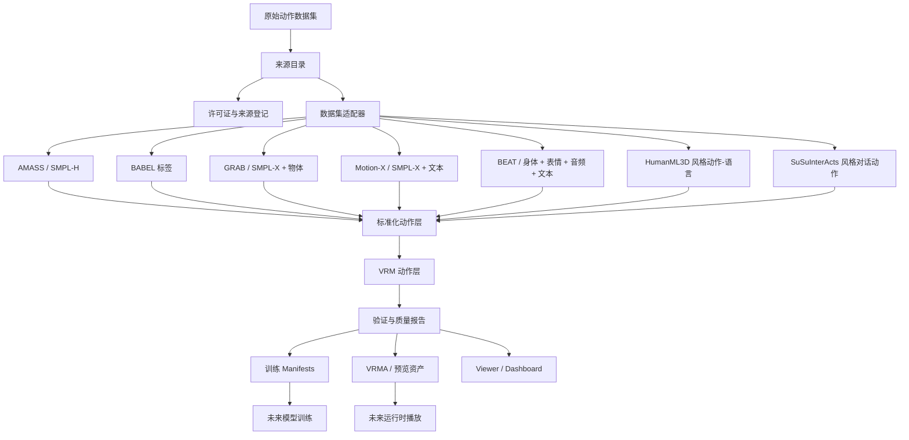

# VIREA 中文说明

> **VIREA: VRM-native Interactive Response & Embodied Avatar**

VIREA 是一个面向交互式具身数字人动作研究的 VRM-native 基础设施项目。项目目标是建立一套清晰、可扩展、重视许可证边界，并以 VRM 为中心的动作数据基础，为未来的 **text-to-VRM-motion** 和 **conversation-driven avatar behavior generation** 提供稳定底座。

现代图像与视频生成系统可以创造视觉上真实的世界，但它们并不必然产生可执行的身体。VIREA 将 VRM 人形骨架视为连接高层语义意图与低层连续动作的可执行具身接口。

## 项目状态

**当前阶段：** 早期研究脚手架与数据基础设施设计。

本仓库目前不是最终模型发布仓库。第一个里程碑是先构建可靠的 **VRM 动作中心数据平台**，再决定是否采用 diffusion、flow matching、VQ-VAE、Transformer、latent diffusion 或 MLLM-based generation 等具体模型路线。

在启动阶段，仓库会刻意保持轻量。本文档描述的目标架构代表项目方向，并不表示所有模块都已经实现。

## 项目定位

VIREA 面向的长期场景如下：

```text
用户对话 / 上下文 / 情绪 / 音频
        |
        v
语义动作意图
        |
        v
连续 VRM 人形动作
        |
        v
实时交互对话中的 VRM 角色播放
```

当前更具体的目标是：

```text
异构人体动作数据集
        |
        v
标准化动作表示
        |
        v
以 VRM 为中心的动作资产
        |
        v
可训练动作数据 + 可预览 VRM 动画
```

## 为什么选择 VRM？

VRM 是一个实用的虚拟具身目标，因为它具备：

- 基于 glTF 的人形角色格式。
- 标准化的人形骨骼映射。
- 覆盖 Unity、Web、Blender 与虚拟角色应用的运行时生态。
- 连接数字伴侣、虚拟智能体、游戏、VTuber 与具身 AI 研究的自然桥梁。
- 在进入实体机器人之前，用较低成本提供高表现力的具身交互测试床。

因此，VIREA 不把 VRM 仅仅看作导出格式，而是把它作为虚拟具身动作的执行底座。

## 研究动机

### 1. 从视觉生成到可执行行为

图像和视频生成可以合成视觉上可信的行为，但这些行为经常停留在像素层面。一个生成视频可以展示人在运动，却未必提供可控制的身体、关节层级、动作状态或运行时接口。

VIREA 关注的是可执行的骨架动作，而不是像素。

### 2. 从生成到控制

具身智能需要把语言、情绪、对话意图和上下文等高层信号映射为低层动作。骨架是一个有价值的中间抽象，因为它：

- 比像素更结构化。
- 比文本更可执行。
- 比网格表面更容易迁移。
- 比视频帧序列更可控制。

### 3. 从特定机器人动作空间到通用具身结构

很多具身 AI 系统围绕特定机器人本体构建。VIREA 从更一般的具身结构出发：

```text
身体拓扑 + 关节约束 + 运动学 + 运行时控制接口
```

VRM 是第一个目标具身形态。长期设计应保留对 SMPL-X 类身体、游戏骨架以及潜在人形机器人的兼容空间。

### 4. 从静态角色到交互式具身伙伴

AI 伴侣或数字角色不应该只会说话。它还应根据当前对话上下文，以匹配的身体动作、姿态、手势、表情和时间节奏作出回应。

VIREA 面向的最终交互环如下：

```text
对话状态 -> 角色回应 -> 身体动作 -> 实时反馈 -> 下一轮对话
```

## 核心目标

### 数据基础设施

建立统一数据层，用于组织、验证、转换和打包来自以下来源的动作数据：

- AMASS
- BABEL
- GRAB
- Motion-X
- BEAT
- Human3D / HumanML3D 风格的动作-语言数据
- SuSuInterActs / SentiAvatar 风格的对话式数字人动作数据

### VRM 中心动作表示

定义项目级 schema，覆盖：

- VRM 人形骨骼动作
- 根节点轨迹
- 局部关节旋转
- 表情通道
- 文本标注
- 情绪标注
- 接触信号
- 数据来源追踪
- 许可证记录
- 质量报告

### 工程可复现性

维护可复现的转换、验证、打包和预览流程：

```text
原始数据
  -> 来源目录
  -> 标准化动作
  -> VRM 动作资产
  -> 质量报告
  -> 训练 manifest
  -> 预览 viewer
```

### 模型就绪接口

在选择具体架构之前，先定义稳定的模型侧接口：

- `MotionBatch`
- `ConditionBatch`
- `MotionSample`
- `GeneratorOutput`
- `RuntimeMotionChunk`
- `AvatarState`
- `DialogueState`

### 运行时准备

为未来持续对话场景准备：

- 流式动作片段。
- 可中断生成。
- 基于当前姿态的连续生成。
- 感知对话轮次的动作调度。
- 角色状态记忆。

## 非目标

当前阶段，VIREA 不试图最终确定：

- 特定重定向算法。
- 特定 text-to-motion 模型。
- 特定 diffusion、flow、VQ 或 Transformer 架构。
- 最终损失函数。
- 最终运行时协议。
- 受限数据集的公开再分发。

这些决策会在数据 schema 与 VRM 动作底座稳定后再推进。

## 系统概览



## 当前仓库策略

启动阶段仓库应保持轻量：

- Git 中只放代码、schema、配置、文档和极小的合成 fixture。
- 原始数据集、完整处理数据、训练缓存、生成预览和发布包都应放在 Git 之外。
- 在接口和 schema 稳定前，不提前创建完整目标目录树。
- 文档可以说明计划模块，但不能暗示尚不存在的工具已经可用。

## 目标仓库布局

以下是项目脚手架实现后的目标结构。它是目标架构，不是当前启动阶段的实际文件列表。

```text
virea/
├─ README.md
├─ LICENSE
├─ CITATION.cff
├─ pyproject.toml
├─ package.json
├─ pnpm-workspace.yaml
├─ .gitignore
├─ .gitattributes
├─ Makefile
│
├─ configs/
│  ├─ project.yaml
│  ├─ datasets/
│  ├─ skeletons/
│  ├─ assets/
│  ├─ releases/
│  └─ experiments/
│
├─ schemas/
├─ registries/
├─ src/virea/
│  ├─ data/
│  ├─ motion/
│  ├─ vrm/
│  ├─ model/
│  ├─ runtime/
│  ├─ eval/
│  └─ utils/
│
├─ apps/
│  ├─ viewer-web/
│  └─ lab-dashboard/
│
├─ tools/
├─ workflows/
├─ doc/
├─ examples/
├─ tests/
└─ data/
```

## 外部数据根目录

大型数据集不应存储在本 Git 仓库中。

设置外部数据根目录：

```bash
export VIREA_DATA_ROOT=/path/to/virea_data
```

```powershell
$env:VIREA_DATA_ROOT = "D:\virea_data"
```

推荐外部结构：

```text
$VIREA_DATA_ROOT/
├─ raw/
│  ├─ amass/
│  ├─ babel/
│  ├─ grab/
│  ├─ motionx/
│  ├─ beat/
│  ├─ human3d/
│  ├─ humanml3d/
│  └─ susuinteracts/
│
├─ external/
│  ├─ avatars/
│  ├─ smpl/
│  ├─ smplh/
│  ├─ smplx/
│  ├─ objects/
│  └─ scenes/
│
├─ registry/
├─ work/
├─ canonical/
├─ vrm/
├─ releases/
└─ logs/
```

## 数据来源范围

| 来源 | 模态 | 原生表示 | 在 VIREA 中的作用 |
| --- | --- | --- | --- |
| AMASS | 纯动作 mocap | SMPL / SMPL-H 风格身体参数 | 大规模动作先验 |
| BABEL | AMASS 动作标签 | 序列级与帧级语言标签 | 语义动作对齐 |
| GRAB | 全身物体交互 | SMPL-X 身体、手、物体、接触 | 物体感知动作与抓取 |
| Motion-X | 表现性全身动作 | SMPL-X + 文本与姿态描述 | 全身 text-motion 预训练 |
| BEAT | 身体、表情、音频、文本、情绪 | 对话手势数据 | 对话手势与情绪动作 |
| Human3D / HumanML3D 风格数据 | 动作-语言对 | 文本条件短动作片段 | text-to-motion 基线 |
| SuSuInterActs / SentiAvatar 风格数据 | 对话、语音、全身动作、面部 | 交互式数字人动作语料 | 长期对话式数字人目标 |

## 动作资产理念

VIREA 使用以动作样本为中心的数据模型。与其仅按数据集名称组织文件，每个处理后的片段都应成为一个 `MotionSample`，并包含：

- `motion_uid`
- 来源数据集
- 来源序列 ID
- 时间范围
- 骨架 profile
- 动作 payload 路径
- 标注 payload 路径
- VRM 资产路径
- 预览路径
- 质量报告路径
- 许可证记录
- 引用记录

这使训练、评估、预览和发布流程都可以基于统一样本抽象运行。

## Motion UID

项目使用确定性动作 ID 保证可复现性。

推荐格式：

```text
virea:{dataset}:{source_id}:{start_frame}:{end_frame}:{hash8}
```

示例：

```text
virea:beat:speaker01_seq0008:000000:000360:a13f9c2e
virea:humanml3d:000421:000000:000196:b82f0a91
virea:motionx:scene0007_clip003:000000:000240:c992ef11
```

## 核心 Schema：MotionSample

处理后的样本大致应遵循以下结构：

```json
{
  "schema_version": "virea.motion_sample.v0.1.0",
  "motion_uid": "virea:beat:speaker01_seq0008:000000:000360:a13f9c2e",
  "source": {
    "dataset": "beat",
    "source_id": "speaker01_seq0008",
    "source_version": "unknown",
    "license_family": "beat_non_commercial",
    "redistribution_allowed": false,
    "citation_keys": ["beat_2022"]
  },
  "time": {
    "fps": 30,
    "num_frames": 360,
    "duration_sec": 12.0,
    "start_frame": 0,
    "end_frame": 360
  },
  "skeleton": {
    "source_skeleton": "beat_63j",
    "canonical_skeleton": "virea_canonical_v0.1",
    "target_skeleton": "vrm1_humanoid",
    "coordinate_system": "gltf_y_up_z_forward",
    "rotation_format": "quat_xyzw",
    "unit": "meter"
  },
  "modalities": {
    "body": true,
    "hands": true,
    "face": true,
    "text": true,
    "audio": false,
    "emotion": true,
    "object": false
  },
  "annotations": [
    {
      "type": "text",
      "language": "en",
      "text": "The speaker explains something while gesturing with both hands.",
      "start_sec": 0.0,
      "end_sec": 12.0,
      "confidence": 1.0
    }
  ],
  "files": {
    "canonical_motion": "canonical/v0.1.0/motion/beat/xxx.npz",
    "vrm_motion": "vrm/v0.1.0/motion/beat/xxx.npz",
    "vrma": "vrm/v0.1.0/animation/beat/xxx.vrma",
    "preview": "vrm/v0.1.0/previews/beat/xxx.mp4",
    "quality_report": "vrm/v0.1.0/quality/beat/xxx.json"
  },
  "quality": {
    "schema_valid": true,
    "quat_norm_error_max": 0.0001,
    "bone_length_error_mean": 0.008,
    "foot_skate_score": 0.12,
    "ground_penetration_ratio": 0.01,
    "retarget_score": 0.87,
    "status": "passed"
  }
}
```

## VRM 动作表示

VIREA 区分训练 payload 与播放 payload。

### 训练 payload

训练侧动作使用紧凑张量格式，例如：

- `.npz`
- `.parquet`
- `.jsonl` manifest

训练动作 payload 可以包含：

```json
{
  "time": "float32[T]",
  "hips_pos": "float32[T, 3]",
  "root_rot": "float32[T, 4]",
  "bone_rot": "float32[T, J, 4]",
  "bone_names": "str[J]",
  "contacts": "bool[T, C]",
  "expression_values": "float32[T, E]",
  "valid_mask": "bool[T]"
}
```

### 播放 payload

运行时预览和播放资产可以使用：

- `.vrma`
- `.glb` / `.vrm` 引用
- `.mp4` 预览

`.vrma` 输出主要用于 VRM 兼容动画播放和检查，不一定作为主训练格式。

## 坐标与单位约定

除非明确说明，VIREA 遵循 glTF / VRM 约定。

| 字段 | 约定 |
| --- | --- |
| 坐标系 | 右手系 |
| 上方向 | `+Y` |
| 前方向 | `+Z` |
| 单位 | meter |
| 旋转存储 | 四元数 `XYZW` |

所有坐标转换都应在对应的数据集 adapter 和 skeleton profile 中明确记录。

## 数据集登记

数据集记录预计维护在 `registries/datasets.yaml`。

示例：

```yaml
beat:
  name: "BEAT"
  full_name: "Body-Expression-Audio-Text Dataset"
  type: "conversational_gesture"
  modalities:
    body: true
    hands: true
    face: true
    audio: true
    text: true
    emotion: true
  raw_root_env: "BEAT_ROOT"
  license_family: "beat_non_commercial"
  citation_keys:
    - beat_2022
  adapter: "virea.data.adapters.beat.BEATAdapter"
```

## 许可证登记

许可证记录预计维护在 `registries/licenses.yaml`。

示例：

```yaml
amass_non_commercial:
  commercial_use: false
  public_redistribution: false
  derived_motion_public_release: false
  requires_registration: true
  notes: "Check the original AMASS license before using or redistributing processed data."

beat_non_commercial:
  commercial_use: false
  public_redistribution: "check_required"
  derived_motion_public_release: "check_required"
  requires_registration: true
  notes: "Use only according to the BEAT dataset terms."

public_synthetic:
  commercial_use: true
  public_redistribution: true
  derived_motion_public_release: true
  requires_registration: false
```

每个处理后的样本都应携带 `license_family` 字段。

## 发布策略

VIREA 区分代码、元数据、演示和受限数据。

| 发布目标 | 内容 | 可见性 |
| --- | --- | --- |
| GitHub 仓库 | 代码、配置、schema、文档、极小合成 fixture | 公开 |
| Hugging Face 公开数据集 | Dataset card、schema、metadata-only 记录、合法 tiny demo | 公开 |
| Hugging Face 私有或 gated 数据集 | 允许再分发或访问受控的处理数据 | 私有 / gated |
| 本地存储 | 完整原始数据、完整处理数据、完整训练缓存 | 私有 |

不要把受限原始数据或派生数据上传到公开 GitHub。

## 文件格式策略

| 用途 | 格式 |
| --- | --- |
| 样本元数据 | JSON |
| 数据集 manifest | JSONL |
| 表格元数据 | Parquet |
| 训练张量 payload | NPZ |
| VRM 动画预览 | VRMA |
| 人类可读配置 | YAML |
| 质量报告 | JSON |
| 预览视频 | MP4 |

## 安装

安装命令在早期开发阶段可能变化。

```bash
git clone https://github.com/<your-org>/virea.git
cd virea

# Python 环境
uv sync

# Web apps
pnpm install
```

替代 Python 安装方式：

```bash
python -m venv .venv
source .venv/bin/activate
pip install -e ".[dev]"
```

Windows PowerShell：

```powershell
python -m venv .venv
.\.venv\Scripts\Activate.ps1
pip install -e ".[dev]"
```

## 环境变量

```bash
export VIREA_DATA_ROOT=/path/to/virea_data

export AMASS_ROOT=$VIREA_DATA_ROOT/raw/amass
export BABEL_ROOT=$VIREA_DATA_ROOT/raw/babel
export GRAB_ROOT=$VIREA_DATA_ROOT/raw/grab
export MOTIONX_ROOT=$VIREA_DATA_ROOT/raw/motionx
export BEAT_ROOT=$VIREA_DATA_ROOT/raw/beat
export HUMANML3D_ROOT=$VIREA_DATA_ROOT/raw/humanml3d
export SUSUINTERACTS_ROOT=$VIREA_DATA_ROOT/raw/susuinteracts
```

```powershell
$env:VIREA_DATA_ROOT = "D:\virea_data"

$env:AMASS_ROOT = "$env:VIREA_DATA_ROOT\raw\amass"
$env:BABEL_ROOT = "$env:VIREA_DATA_ROOT\raw\babel"
$env:GRAB_ROOT = "$env:VIREA_DATA_ROOT\raw\grab"
$env:MOTIONX_ROOT = "$env:VIREA_DATA_ROOT\raw\motionx"
$env:BEAT_ROOT = "$env:VIREA_DATA_ROOT\raw\beat"
$env:HUMANML3D_ROOT = "$env:VIREA_DATA_ROOT\raw\humanml3d"
$env:SUSUINTERACTS_ROOT = "$env:VIREA_DATA_ROOT\raw\susuinteracts"
```

## 规划中的 CLI

CLI 会围绕数据生命周期阶段设计。以下命令描述计划接口，实际可用性取决于对应模块是否已经实现。

```bash
# 1. Catalog raw files
virea catalog \
  --config configs/pipelines/catalog.yaml \
  --out $VIREA_DATA_ROOT/registry/raw_file_index.parquet

# 2. Build dataset manifests
virea manifest build \
  --datasets beat humanml3d amass babel \
  --out $VIREA_DATA_ROOT/canonical/v0.1.0/manifests

# 3. Validate metadata and licenses
virea validate \
  --manifest $VIREA_DATA_ROOT/canonical/v0.1.0/manifests/train.jsonl

# 4. Package processed data
virea package \
  --release configs/releases/v0.1.0-data.yaml

# 5. Preview samples
virea preview \
  --motion-uid virea:beat:speaker01_seq0008:000000:000360:a13f9c2e \
  --avatar examples/tiny_avatar/default.vrm
```

## Viewer

Web viewer 用于检查 VRM 动作质量。

计划功能：

- 加载 `.vrm` 角色。
- 加载处理后的 VIREA 动作样本。
- 加载 `.vrma` 预览动画。
- 显示文本、情绪、来源和许可证元数据。
- 显示骨架 overlay。
- 显示根节点轨迹。
- 显示足部接触指标。
- 比较多个 avatar 身体。
- 导出预览截图和视频。
- 将样本标记为 passed、suspicious 或 failed。

计划位置：

```text
apps/viewer-web/
```

## Lab Dashboard

Lab dashboard 用于数据集级检查。

计划面板：

- 按来源统计数据集组成。
- 时长分布。
- 帧率分布。
- 骨架 profile 分布。
- 许可证 family 分布。
- 质量分数分布。
- 失败样本浏览。
- 预览 gallery。
- split 泄漏检查。
- 重复来源序列检查。

计划位置：

```text
apps/lab-dashboard/
```

## 模型接口

模型层刻意保持方法无关。早期阶段只定义契约和数据接口。

计划接口：

- `ConditionBatch`
- `MotionBatch`
- `MotionSample`
- `GeneratorInput`
- `GeneratorOutput`
- `RuntimeMotionChunk`

后续模型可以采用以下一种或多种范式：

- Motion tokenizer + language model。
- VAE / latent motion manifold。
- Diffusion model。
- Latent diffusion model。
- Flow matching / rectified flow。
- Masked motion modeling。
- MLLM / LLM backbone with motion expert。
- 高层离散规划 + 低层连续动作生成的混合方案。

当前阶段不预设单一架构。

## 运行时接口

运行时层为交互式对话做准备。

计划抽象：

- `DialogueState`
- `AvatarState`
- `MotionRequest`
- `MotionChunk`
- `StreamBuffer`
- `MotionScheduler`
- `RuntimeContract`

长期目标不只是生成单个孤立动作片段，而是支持连续角色行为：

```text
当前姿态 + 对话状态 + 语义意图
        |
        v
下一段动作
        |
        v
流式 VRM 播放
        |
        v
更新后的角色状态
```

## 质量评估

VIREA 同时使用数值质量检查和视觉质量检查。

| 指标 | 目的 |
| --- | --- |
| `schema_valid` | 元数据是否符合项目 schema |
| `quat_norm_error` | 旋转是否为有效单位四元数 |
| `bone_length_error` | 骨长是否稳定 |
| `root_velocity_spike` | 根节点动作是否有不连续尖峰 |
| `joint_angle_spike` | 关节旋转是否有突然跳变 |
| `foot_skate_score` | 脚部是否不自然滑动 |
| `ground_penetration_ratio` | 脚或身体是否穿地 |
| `left_right_flip_score` | 左右映射是否可疑 |
| `facing_direction_error` | 前向方向是否不一致 |
| `retarget_score` | VRM 动作质量综合分数 |

## 路线图

### v0.1.0 - 数据基础设施脚手架

- [ ] 仓库骨架
- [ ] 配置结构
- [ ] Schema 定义
- [ ] 数据集登记
- [ ] 许可证登记
- [ ] 引用登记
- [ ] Tiny synthetic examples
- [ ] 初始 viewer scaffold
- [ ] 初始文档

### v0.2.0 - 数据集 Catalog 与 Manifest 层

- [ ] 原始文件 catalog
- [ ] 选定数据集 source adapters
- [ ] 数据集 manifest 生成
- [ ] 许可证验证
- [ ] 引用验证
- [ ] split 管理
- [ ] 元数据导出

### v0.3.0 - VRM 动作资产层

- [ ] VRM humanoid profile
- [ ] VRM motion schema
- [ ] VRMA export interface
- [ ] 预览生成
- [ ] 质量报告
- [ ] 基于 viewer 的检查

### v0.4.0 - 训练接口层

- [ ] 训练 dataset loader
- [ ] Motion batch interface
- [ ] Condition batch interface
- [ ] 基础数据统计
- [ ] 最小训练 smoke test

### v0.5.0 - 第一个 Text-to-VRM-Motion Baseline

- [ ] 第一个 baseline model
- [ ] 离线生成
- [ ] VRM 预览评估
- [ ] text-motion alignment 评估
- [ ] failure case gallery

### v0.6.0 - 交互式动作运行时

- [ ] 基于当前姿态的生成
- [ ] 流式动作片段
- [ ] 基于对话状态的生成
- [ ] Runtime API
- [ ] Live viewer demo

## 相关数据集

### AMASS

AMASS 将多个 marker-based mocap 数据集统一到通用 body-model 表示中，适合学习 motion-only prior。

- Project: <https://amass.is.tue.mpg.de/>
- Paper: <https://arxiv.org/abs/1904.03278>

### BABEL

BABEL 在 AMASS 序列上提供动作标签，包括序列级和帧级标签。

- Project: <https://babel.is.tue.mpg.de/>
- Paper: <https://arxiv.org/abs/2106.09696>

### GRAB

GRAB 提供全身人类抓取数据，包括 SMPL-X 身体、物体姿态和接触标注。

- Project: <https://grab.is.tue.mpg.de/>
- Code: <https://github.com/otaheri/GRAB>

### Motion-X

Motion-X 提供大规模表现性全身动作标注，包含 SMPL-X 与文本描述。

- Project: <https://motion-x-dataset.github.io/>
- Paper: <https://arxiv.org/abs/2307.00818>

### BEAT

BEAT 提供多模态对话手势数据，包含身体动作、面部表情、音频、文本、情绪和语义相关标注。

- Project: <https://pantomatrix.github.io/BEAT/>
- Paper: <https://arxiv.org/abs/2203.05297>

### HumanML3D

HumanML3D 是广泛使用的 text-to-motion benchmark，提供动作-语言对。

- Code/Data: <https://github.com/EricGuo5513/HumanML3D>
- Paper: <https://arxiv.org/abs/2204.14109>

### SuSuInterActs / SentiAvatar

SuSuInterActs 是 SentiAvatar 引入的对话式数字人数据集，目标是表现性和交互式全身数字人。

- Project: <https://sentiavatar.github.io/>
- Hugging Face dataset: <https://huggingface.co/datasets/Chuhaojin/SuSuInterActs>
- Paper: <https://arxiv.org/abs/2604.02908>

## 相关动作生成项目

- MDM - Human Motion Diffusion Model: [paper](https://arxiv.org/abs/2209.14916), [code](https://github.com/GuyTevet/motion-diffusion-model)
- MotionDiffuse: [paper](https://arxiv.org/abs/2208.15001), [code](https://github.com/mingyuan-zhang/MotionDiffuse)
- MLD - Motion Latent Diffusion: [paper](https://arxiv.org/abs/2212.04048), [code](https://github.com/ChenFengYe/motion-latent-diffusion)
- T2M-GPT: [paper](https://arxiv.org/abs/2301.06052), [code](https://github.com/Mael-zys/T2M-GPT)
- MotionGPT: [project](https://motion-gpt.github.io/), [code](https://github.com/OpenMotionLab/MotionGPT), [paper](https://arxiv.org/abs/2306.14795)
- MoMask: [project](https://ericguo5513.github.io/momask/), [paper](https://arxiv.org/abs/2312.00063)
- AMUSE: [project](https://amuse.is.tue.mpg.de/), [paper](https://arxiv.org/abs/2312.04466)
- MotionLab: [paper](https://arxiv.org/abs/2502.02358)
- UniMotion: [paper](https://arxiv.org/abs/2603.22282)

## 相关 VRM / Runtime 资源

- VRM official site: <https://vrm.dev/>
- VRM 1.0: <https://vrm.dev/en/vrm1/>
- VRM Humanoid: <https://vrm.dev/en/vrm1/humanoid/>
- VRM Animation: <https://vrm.dev/en/vrma/>
- VRMA specification: <https://github.com/vrm-c/vrm-specification/tree/master/specification/VRMC_vrm_animation-1.0>
- glTF 2.0 specification: <https://registry.khronos.org/glTF/specs/2.0/glTF-2.0.html>
- three-vrm: <https://github.com/pixiv/three-vrm>
- UniVRM: <https://github.com/vrm-c/UniVRM>

## 文档计划

当前 `doc/` 下只放置这份中文启动文档。

未来计划补充：

- 项目范围
- 架构
- 数据布局
- Schema reference
- VRM notes
- 发布策略
- 许可证矩阵
- Dataset card template
- Model card template
- 架构决策记录
- Survey notes

## 开发原则

### 1. 不隐藏数据来源

每个样本都应能追溯到：

- 来源数据集
- 来源文件
- 来源序列
- 时间范围
- 许可证 family
- 引用 key
- 处理版本

### 2. 不静默混合许可证 family

具有不同再分发条款的数据必须保持可分离。

### 3. 不过早绑定单一模型

数据层应能经受模型架构变化。

### 4. 不把预览视为可选项

对于 VRM 动作，视觉检查是数据管线的一部分。

### 5. 不在 Git 中存储大型数据集

GitHub 应存放代码、schema、配置、文档和极小示例。大型数据应放在本地存储、对象存储或专门的数据集托管平台。

### 6. 分离训练接口和运行时接口

训练数据可以使用紧凑张量格式。运行时播放可以使用 VRMA 或其他面向 avatar 的格式。

## 贡献

项目仍处于早期设计阶段。

有价值的贡献包括：

- 数据集 adapter 设计。
- Schema review。
- VRM humanoid mapping review。
- 许可证矩阵修正。
- 动作质量指标。
- Viewer 设计。
- 文档改进。
- 可复现 tiny examples。
- 相关论文和项目 survey 更新。

在贡献任何来自数据集的文件之前，请确认对应许可证允许再分发。

## 引用

如果使用 VIREA，请引用本仓库以及处理数据所依赖的原始数据集或论文。

项目引用占位：

```bibtex
@misc{virea2026,
  title        = {VIREA: VRM-native Interactive Response and Embodied Avatar Motion Infrastructure},
  author       = {VIREA Contributors},
  year         = {2026},
  howpublished = {\url{https://github.com/<your-org>/virea}},
  note         = {Research infrastructure for VRM-centered interactive embodied avatar motion}
}
```

数据集与方法引用将在 registry 创建后加入 `registries/citations.yaml`。

## 许可证

代码许可证当前为 **TBD**。

数据集许可证因来源而异。本仓库不授予任何第三方数据集的再分发权限。用户需要自行遵守 AMASS、BABEL、GRAB、Motion-X、BEAT、HumanML3D、SuSuInterActs 以及其他数据来源的条款。

## 致谢

VIREA 受到人体动作捕捉数据集、text-to-motion 生成、speech-driven gesture synthesis、latent diffusion 与 flow-based motion generation、VRM avatar 生态、glTF runtime animation、交互式数字人系统、具身 AI 和虚拟智能体等方向的研究与工程进展启发。

项目建立在 AMASS、BABEL、GRAB、Motion-X、BEAT、HumanML3D、SentiAvatar、MDM、MotionDiffuse、MLD、T2M-GPT、MotionGPT、MoMask、AMUSE、MotionLab、UniMotion、VRM、UniVRM 和 three-vrm 等开放研究社区成果之上。

## 简短总结

VIREA 不只是一个 text-to-motion 模型仓库。

它被设计为 VRM-native 的具身动作基础设施：

```text
datasets
  -> schemas
  -> VRM-centered motion assets
  -> quality reports
  -> preview tools
  -> model interfaces
  -> runtime interfaces
  -> interactive avatar behavior
```

第一个里程碑是建立动作底座。第二个里程碑是训练生成模型。最终里程碑是支持实时对话中连续、表现性、交互式的 VRM 角色行为。
